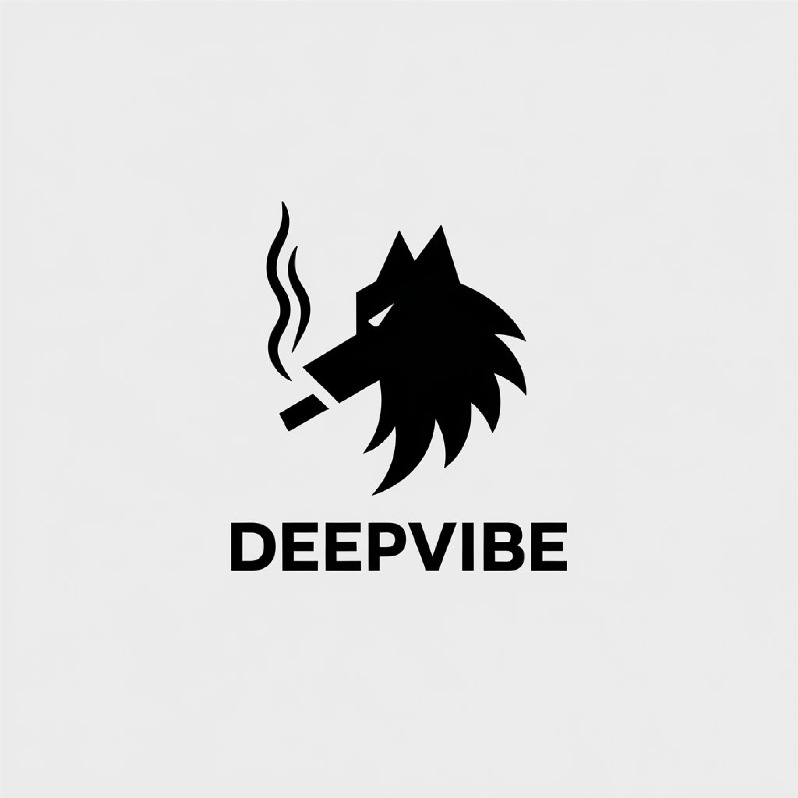
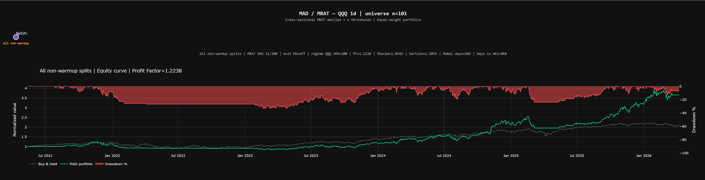

<p align="center">
  
</p>

<p align="center">
  
</p>

# DeepVibe AI Hedge Fund

Standalone **MAD / MRAT** cross-sectional equity research stack: download daily OHLCV from **Alpaca**, store it in **SQLite**, assign walk-forward **splits**, run a **panel backtest** with optional **QQQ regime** filtering, and trade the same logic on **Alpaca** via the **live bot**.

**MRAT** (moving average distance ratio) ranks names each day by short-SMA / long-SMA vs the cross-sectional distribution, then applies σ-based long/short bands. **MAD** is the project’s name for this MRAT-first workflow (metrics, dashboards, live).

---

## Repository layout

| Path | Role |
|------|------|
| `src/deepvibe_hedge/config.py` | Single source of truth: universe, dates, splitter, MAD grids, live flags |
| `src/deepvibe_hedge/alpaca_fetcher.py` | Historical bars → `data/ohlcv/{SYMBOL}_{gran}.db` + `.csv` |
| `src/deepvibe_hedge/data_splitter.py` | Splits + SMA columns (periods from `splitter_ma_periods()`) |
| `src/deepvibe_hedge/ohlcv_live_append.py` | Live-only incremental daily bars + `sma_21` / `sma_200` refresh |
| `src/deepvibe_hedge/db_utils.py` | CLI to inspect OHLCV SQLite files |
| `src/deepvibe_hedge/mad/backtester.py` | Panel backtest, Dash dashboards, optimiser SQLite under `data/mad/` |
| `src/deepvibe_hedge/mad/live_bot.py` | Alpaca paper/live execution aligned with the backtester |
| `src/deepvibe_hedge/paths.py` | `DATA_ROOT`, `OHLCV_DIR`, `MAD_DATA_DIR` |

The `data/` directory is **gitignored** (local SQLite and CSV only). After you run the fetcher, files appear at **`data/ohlcv/`** and **`data/mad/`** next to the repo root.

---

## Setup

**Requirements:** Python **≥ 3.10** (see `pyproject.toml`).

```bash
cd "/path/to/DeepVibe AI Hedge Fund"
python -m venv .venv
source .venv/bin/activate   # Windows: .venv\Scripts\activate
pip install -e ".[dev]"
```

**Alpaca credentials:** copy `.env.example` to `.env` and set keys (paper vs live names are documented there). The fetcher accepts several env var aliases for keys and secrets.

**Run modules with `PYTHONPATH=src`** (package lives under `src/deepvibe_hedge`):

```bash
export PYTHONPATH=src
```

---

## End-to-end workflow

### 1. Configure

Edit **`src/deepvibe_hedge/config.py`**:

- **`MAD_UNIVERSE_TICKERS`** — default is `nasdaq100`; can be a tuple or one symbol.
- **`TARGET_CANDLE_GRANULARITY`** — typically **`1d`** for this stack.
- **`TARGET_START_DATE` / `OHLCV_DOWNLOAD_END_MODE`** — history window for the fetcher.
- **`OHLCV_PIPELINE_MODE`** — `mad_universe` (full universe + regime ticker if enabled) or `target_only`.
- **Splitter / MAD grids** — walk-forward split count, `splitter_ma_periods()` (derived from MRAT / exit / regime grids + live regime MA).

### 2. Download OHLCV

```bash
PYTHONPATH=src python -m deepvibe_hedge.alpaca_fetcher
```

Writes one **`ohlcv`** table per symbol under **`data/ohlcv/{TICKER}_{gran}.db`** and mirrors a CSV. Uses **`ALPACA_BAR_ADJUSTMENT`** (default split-adjusted) and **`LIVE_BOT_DATA_FEED`** (e.g. IEX).

### 3. Splits + SMA columns

```bash
PYTHONPATH=src python -m deepvibe_hedge.data_splitter
```

- **Split 0** = warmup so the longest configured SMA is valid from the first bar of split 1.
- **Splits 1…N** = equal chunks for in-sample / out-of-sample research.
- SMAs written match **`splitter_ma_periods()`** (union of short/long MRAT grids, positive exit/regime grid values, etc.).

### 4. Inspect databases (optional)

```bash
PYTHONPATH=src python -m deepvibe_hedge.db_utils
PYTHONPATH=src python -m deepvibe_hedge.db_utils splits QQQ_1d
PYTHONPATH=src python -m deepvibe_hedge.db_utils indicators AAPL_1d
```

### 5. Backtest

```bash
PYTHONPATH=src python -m deepvibe_hedge.mad.backtester
PYTHONPATH=src python -m deepvibe_hedge.mad.backtester --no-dashboard
```

Produces metrics, sweep tables, and SQLite/CSV under **`data/mad/`** (paths depend on reference ticker and granularity, e.g. `QQQ_1d_mad_optim.db`).

### 6. Live trading (Alpaca)

```bash
PYTHONPATH=src python -m deepvibe_hedge.mad.live_bot --dry-run   # targets only
PYTHONPATH=src python -m deepvibe_hedge.mad.live_bot --once        # single cycle
PYTHONPATH=src python -m deepvibe_hedge.mad.live_bot               # poll loop
```

**Behaviour highlights:**

- **OHLCV append (`MAD_LIVE_APPEND_DAILY_OHLCV`, default on):** each non–dry-run cycle **starts** by pulling any missing **daily** bars from Alpaca into `data/ohlcv/*.db`, re-applies **`split`** when possible, and refreshes **`sma_21` + `sma_200`** on universe names. The **regime ETF** file (e.g. QQQ) gets **`sma_200` only**; **`sma_21`** is cleared there. Requires existing DBs from the fetcher first.
- **Precomputed SMAs for MRAT (`MAD_LIVE_USE_PRECOMPUTED_SMA`):** live snapshot can read **`sma_*`** from SQLite when present; otherwise it rolls on **`close`**. Regime precomputed path is for **1d** bars only.
- **Regime-off sleeve (e.g. BIL):** treated as cash-like — **no OHLCV file required**; sizing uses an **Alpaca market quote** only.
- **Params:** `MAD_LIVE_LOAD_PARAMS_FROM_DB` can load MRAT/regime settings from the backtester’s optim summary SQLite; overrides come from `MAD_LIVE_*` fields in `config.py`.

---

## Strategy intuition (short)

- Each date, per ticker: MRAT ≈ SMA(short) / SMA(long). Cross-sectional **deciles** and **σ(MRAT)** set long/short bands (see `MAD_LONG_SIGMA_MULT`, `MAD_SHORT_SIGMA_MULT`, direction mode).
- Optional **regime:** if enabled, when the regime ETF (default **QQQ**) is not above its regime SMA on the prior bar’s logic, the MRAT book can go flat; live can rotate into a **proxy sleeve** (e.g. short-duration ETF) using config under `MAD_LIVE_REGIME_OFF_*`.

Full detail and interpretation notes are in the docstrings at the top of **`mad/backtester.py`** and **`config.py`**.

---

## Related tools

- **`mad/walkforward_oos.py`**, **`mad/permutation_test.py`** — research / robustness around the same panel and optim outputs.
- **`reference_old_folder/`** — legacy swing-trade project for comparison only; the active code is under **`src/deepvibe_hedge/`**.

---

## Logo

Brand asset: **`deepvibe2.png`** (repository root). The image reference in this README is relative to the README file so it renders on GitHub/GitLab when both sit at the project root.
